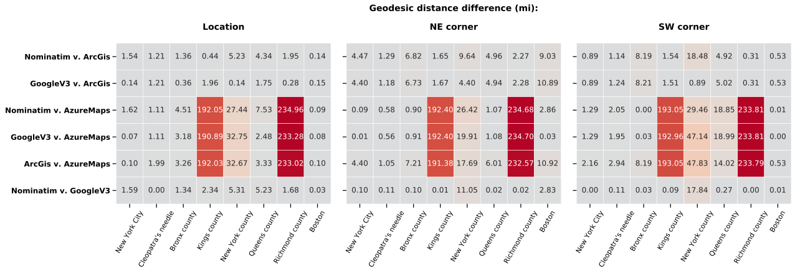
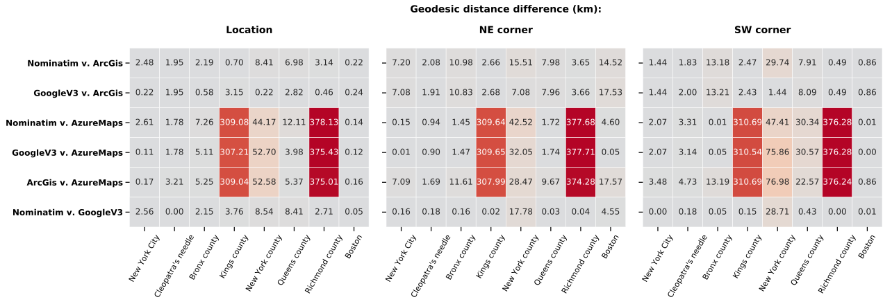

# Comparison of Four Geocoders:
They return different geolocation coordinates for the same place

# Why I setup this comparison:
In another application, I was using the New York City boroughs bounding boxes to impute missing borough names for records with geolocation information; 
After a first pass, some entries were still not imputed despite clearly belonging to a particular borough. 
I then tested several geocoders to find out if the problem was a resolution issue... 
This is how I discovered that the geolocation coordinates - for the same query - could be quite different both for point locations and their bounding boxes.


Needless to say, I had to trash my brilliant processing shortcut; instead, I used clustering for borough name imputation.

The [**notebook** in ./GeocodersComparison/](./GeocodersComparison/Report_Items.iynb) show how to retrieve the data and functions.

# The main conclusion from this comparison:
Depending on the geolocating service used AND the location queried, the geolocation coordinates will be WRONG. 
As I have not checked all available geocoding services - there are to date, 47 of them available via geopy - I cannot rank them, especially since none of 
them can be set as an absolute ground-truth. 
However, my comparison of four geocoders (Nominatim, GoogleV3, ArcGis and AzureMaps), shows some are more consistent that the others, among them Nominatim, the geocoder of OpenStreetMaps and GoogleV3, the geocoder of GooglePlaces API.
ArcGis usually returns the largest bounding boxes, and AzureMaps has - literally - "far out" results on several locations.


This [**HTML report**](./GeocodersComparison/GeocodersComparisonReport.html) includes all the mapping of the locations and boxes.

    



# Note: 
#### It seems that the errors from AzureMaps are due to the wrong parsing of the query string...

Meaning that with this service, portions of the query may have to be assigned to specific parameters. 
This may explain why the coordinates for the query string "Richmond county, New York, NY, USA", which asks for the geolocation of Staten Island, 
one of the boroughs of New York City, returns the coordinates for "Richmond Hill", a Queens neighborhood. Thus AzureMaps ignores portions of the string.


### Location of rendered maps:  ./GeocodersComparison/geodata/html_maps/


# Note: '.env' file is needed #
 
 > **To pass personal data such as an API key, create a text file '.env' where you list your credentials, one per line with the "KEY_NAME=value" format.**
 
 > **KEY_NAME is the argument of os.getenv(), which returns its value.**
 
 > **The value will be local to your system ONLY if the .env file is listed in your .gitignore in your repo (so that it's never uploaded).**


# Query list:
### Each query string was pass to the APIs' main geocoding function as is.

```
query_lst = GeoComp4.query_lst
query_lst`
['New York City, NY, USA',
"Cleopatra's needle, Central Park, New York, NY, USA",
'Bronx county, NY, USA',
'Kings county, NY, USA',
'New York county, NY, USA',
'Queens county, NY, USA',
'Richmond county, NY, USA',
'Boston, MA, USA']
```

# Geoloders in the comparison:
```
geocs = GeoComp4.geocs
geocs
['Nominatim', 'GoogleV3', 'ArcGis', 'AzureMaps']
```

# Places in the query list (they are the keys of the geo dicts), used for accessing data for a particular place:

```
places = GeoComp4.places
places 
['New York City',
 "Cleopatra's needle",
 'Bronx county',
 'Kings county',
 'New York county',
 'Queens county',
 'Richmond county',
 'Boston']
```

# Saved geolocation data for each geocoder are in geo_Nom, geo_Goo, geo_Arc, geo_Azu.
They are combined into a list named geo_dicts to pass to functions.

```
geo_dicts = GeoComp4.geo_dicts
colors_dict = GeoComp4.colors_dict
```

# Output example: data from Nominatim, the search engine of OpenStreetMap:

```
geo_Nom = GeoComp4.geo_Nom
geo_Nom['New York City']
{'box': [[40.9161785, -73.7001809], [40.477399, -74.25909]],
 'loc': [40.7308619, -73.9871558]}
```

# Quantitative comparison: pairwise difference of the geo coordinates in geodesic distance:

##### Distance in kilometers
By default, the plot is saved and not shown --the next cell is used to display it;

```GeoComp4.get_geo_dist_heatmap(places)  # , save_fig=False) # To show it w/o saving it, run with save_fig=False.```



##### Distance in miles:
```GeoComp4.get_geo_dist_heatmap(places, df_dict, unit='mi')```


# Conclusion:
#### As there are 47 geolocating services available via Geopy, I have no doubt that many will be differing as well...